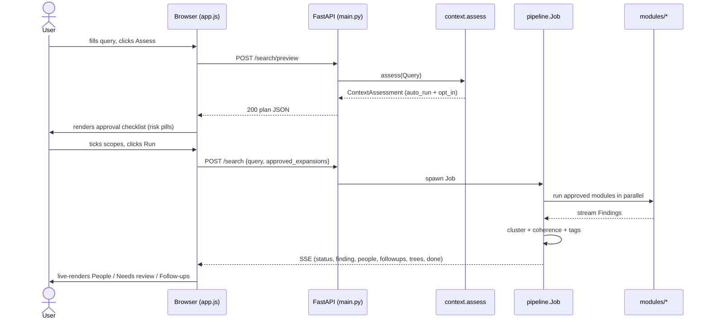

# Specter — Architecture

This document is the system-level companion to the README. It is aimed at
contributors, code reviewers, and academic readers who need to understand
*how* the pieces fit together — not just *what* the tool does.

---

## 1. Design goals

Specter optimises for, in order:

1. **Lawfulness.** No surface that requires authentication or a paid key
   is fetched.
2. **Transparency.** Every claim in a report points back to its
   `source_url` and `fetched_at`; every coherence flag names the rule
   that fired.
3. **Local-first operation.** No hosted backend, no telemetry, no
   long-term persistence. Reports live next to the user on disk.
4. **Determinism.** No LLM in the hot path. Every score is a closed-form
   function of the inputs; every cluster decision is reproducible.
5. **Free expansion.** New sources are added by dropping a single file
   into `src/specter/modules/` and registering it in `context.py`. No
   paid keys; no proprietary dependencies.

---

## 2. Request lifecycle (two-phase)

A search is intentionally two-phase. The first phase is cheap and
contains no scraping — its only job is to let the user *consent* to the
modules that will run.



The two-phase split exists so that risky modules (web-wide username
fan-out, broad search engines) cannot fire until the user has
explicitly approved them, even if a client sends a malformed request.

---

## 3. Data flow

```mermaid
flowchart LR
    Q[Query] --> ASS[context.assess]
    ASS -->|auto_run + opt_in| PLAN[Expansion plan]
    PLAN -->|user approves| RUN[pipeline.Job]
    RUN --> MOD1[targeted modules]
    RUN --> MOD2[academic modules]
    RUN --> MOD3[code_hosts modules]
    RUN --> MODn[…N more expansions]
    MOD1 --> F[Findings stream]
    MOD2 --> F
    MOD3 --> F
    MODn --> F
    F --> FILT[filter.classify]
    FILT -->|keep / demote| CL[cluster.union_find]
    FILT -->|drop| TRASH[(dropped_count)]
    CL --> PEOPLE[Person clusters]
    PEOPLE --> COH[cohere.check]
    COH --> TAG[tagging.assign]
    TAG --> EMIT[SSE: people, findings, trees, followups]
    EMIT --> DISK[(reports/{job_id}.json)]
    EMIT --> UI[(browser)]
```

Everything between **Findings stream** and **EMIT** is in-process, async,
and unobservable to the user until the SSE channel surfaces it. The
disk write at the end is the only side-effect outside the FastAPI
process.

---

## 4. Module map

### Core (`src/specter/`)

| File | Responsibility |
|---|---|
| `main.py` | FastAPI app; HTTP surface (`/search/preview`, `/search`, `/stream/{id}`, `/jobs/{id}`, `/reports/{id}.{json,csv}`). |
| `schema.py` | Pydantic v2 models: `Query`, `Finding`, `Person`, `Expansion`, `ContextAssessment`, `CoherenceReport`, `TreeNode`, `FamilyTree`. Source-of-truth for the wire contract. |
| `config.py` | Env-var driven `Config` dataclass (`SPECTER_HOST_RPS`, `SPECTER_MAX_CONCURRENCY`, `SPECTER_CONTACT_EMAIL`, `SPECTER_REPORTS_DIR`, `HIBP_API_KEY`). |
| `context.py` | `EXPANSION_CATALOG` (10 expansions, low/medium/high risk) and `assess(Query) → ContextAssessment` (auto_run + opt_in lists). |
| `pipeline.py` | `Job` class: orchestrates module execution, clustering, coherence, tagging; emits SSE events. |
| `http.py` | `HttpClient` wrapper around `httpx.AsyncClient`: robots.txt enforcement, per-host rate limiting, login-wall detection. |
| `rate_limit.py` | Per-host token-bucket limiter. |
| `filter.py` | `classify(Finding, Query) → keep | demote | drop` using word-boundary matching with positional cluster span. |
| `names.py` | Variant generation (nicknames, ASCII fold, locale swap) + `has_token_word_boundary` matcher with optional Jaro-Winkler fuzzy fallback. |
| `cluster.py` | Union-find over strong identity signals (ORCID, GitHub login, email, gravatar). |
| `cohere.py` | Four coherence rules: `name_mismatch`, `geo_outlier`, `century_gap`, `domain_outlier`. |
| `interpret.py` | Deterministic one-sentence summary per Person (strength label + why-clause). |
| `tagging.py` | Deterministic tag assignment per Person (`academic`, `developer`, `@Stanford`, `has-email`, `verified:github`, …). |
| `report_pdf.py` | reportlab-based PDF renderer: cover page, methodology box, legal box, one section per Person. |
| `extract.py` | Regex extractors for emails (incl. obfuscated `foo (at) bar dot com`), phones (via `phonenumbers`), URLs. |
| `cross_ref.py` | Cross-referencing across signals; used by clustering. |
| `username_gen.py` | Username variants from a name (used by Sherlock and code_hosts modules). |

### Sources (`src/specter/modules/`)

Each module subclasses `modules.base.Module` and yields `Finding` objects.

| Expansion | Modules |
|---|---|
| `targeted` | `pivot_crawler`, `pgp_keys`, `rdap_domain`, `gravatar`, `hibp_breach` |
| `academic` | `orcid`, `crossref`, `openalex` |
| `archive` | `wayback` |
| `genealogy` | `wikidata_tree` |
| `code_hosts` | `github_user`, `npm_user` |
| `web_search` | `search_ddg` |
| `news` | `news_gdelt` |
| `forums` | `stack_exchange` |
| `public_records` | `sec_edgar` |
| `username_fanout` | `sherlock` |

### Frontend (`src/specter/static/` + `templates/`)

| File | Responsibility |
|---|---|
| `templates/index.html` | Single page: query form, preview/approval panel, People list, Needs-review panel, Trees, Follow-ups, downloads. |
| `static/app.js` | Vanilla JS — no build step. Two-phase flow; session-local `state` (rejected / confirmed sets); SSE consumer; per-Person signal-graph SVG renderer (Person → strong-signals → corroborating findings). |
| `static/style.css` | Risk pills, generation-row tree styling, signal-graph node/edge styling, restrained palette. |

---

## 5. Intelligence pipeline

The pipeline runs inside `pipeline.Job.run()`:

1. **Plan.** `context.assess(query)` decides which modules can run given
   the query fields, separated into `auto_run` (low-risk) and `opt_in`
   (medium/high-risk). The HTTP layer takes the union with the user's
   approval set.
2. **Fan-out.** Each approved module is spawned as a coroutine, sharing
   the single `HttpClient` (so rate limiting is global across modules).
3. **Filter.** Every yielded Finding passes through `filter.classify`,
   which compares the Finding's text against the query's name token
   cluster. `drop`-classified Findings are discarded with a count;
   `demote`-classified findings flow but with reduced confidence.
4. **Cluster.** `cluster.union_find` groups Findings by shared strong
   signals into Persons. A Finding without strong signals starts its
   own Person (singleton cluster).
5. **Coherence.** Each Person is run through `cohere.check`. Findings
   that contradict the cluster's modal signals are flagged with a
   reason and moved to the Needs-review bucket.
6. **Interpret.** `interpret.interpret` synthesizes one sentence per
   Person from the strength of the strong signals, the maximum finding
   confidence, the number of independent sources, and any coherence
   flags. Stored on `Person.summary`.
7. **Tag.** `tagging.assign` walks each Person's Findings and produces
   human-readable tags from deterministic rules
   (`@institution`, `developer`, `prolific-author`, `has-email`, …).
8. **Compute follow-ups.** Walk Findings for novel emails / github
   logins / ORCID IDs and emit a follow-up lead per pivot.
9. **Emit.** SSE events in order: `status`, `finding` (many),
   `people` (full snapshot), `trees`, `followups`, `done`.
   Final report is written to `reports/{job_id}.json` and can be
   re-rendered as PDF on demand via `GET /reports/{job_id}.pdf`.

---

## 6. Extension points

### Adding a new source

1. Create `src/specter/modules/your_source.py` subclassing
   `modules.base.Module`.
2. Implement `async def run(self, query: Query, http: HttpClient) ->
   AsyncIterator[Finding]`.
3. Register it in `context.EXPANSION_CATALOG` under an existing
   expansion or a new one (assign a risk level: low / medium / high).
4. Add a unit test under `tests/` using `respx` to mock HTTP.

That's it. The pipeline picks the new module up via the catalog.

### Adding a new coherence rule

Add a function to `cohere.py` that takes `(person, finding) → reason |
None`, then register it in `cohere.RULES`. Findings that any rule
flags are moved to Needs-review.

### Adding a new tag

Add a `(predicate, tag)` pair to `tagging.RULES`. The predicate is a
function `(person, findings) → bool`. Tags are assigned greedily.

---

## 7. Storage model

There is no database. Reports are flat JSON files under
`SPECTER_REPORTS_DIR` (default `./reports/`). Each file is a single
`Job` snapshot — query, findings, people, coherence reports, trees,
followups, timestamps.

CSV exports are computed on-demand from the JSON snapshot at
`/reports/{id}.csv` and never persisted separately.

The `reports/` directory is `.gitignore`-d (`!reports/.gitkeep`
preserves the dir).

---

## 8. Non-goals (deliberate)

- **No long-term persistence / re-runs.** Specter is a one-shot
  research console. If you want monitoring or diffing, build it on
  top of the JSON exports.
- **No LLM scoring.** Tempting, but it undermines reproducibility
  and forces a third-party dependency.
- **No infrastructure recon.** ASN/subdomain/SSL/favicon-hash
  pivoting belongs in tools like Shodan, Amass, Censys. Specter is
  people-centric.
- **No auth-walled sources.** Even if it's "easy" to scrape — if
  the platform requires a login, Specter does not touch it.
- **No paid keys.** HIBP is the single exception; ships disabled.

---

## 9. Testing

`tests/` is structured by module: one `test_<module>.py` per source,
plus integration tests for the cross-cutting components
(`test_filter`, `test_cohere`, `test_cluster`, `test_context`,
`test_expansion_gating`, `test_followups`, `test_csv_export`,
`test_http_robots`, `test_schema`, `test_names`, `test_platforms`,
`test_tagging`, `test_username_gen`, `test_wikidata_tree`).

HTTP is mocked via `respx` so the suite is deterministic and offline.

```bash
uv run pytest -q       # 81 tests, ~1 second
uv run ruff check .    # lint
```
